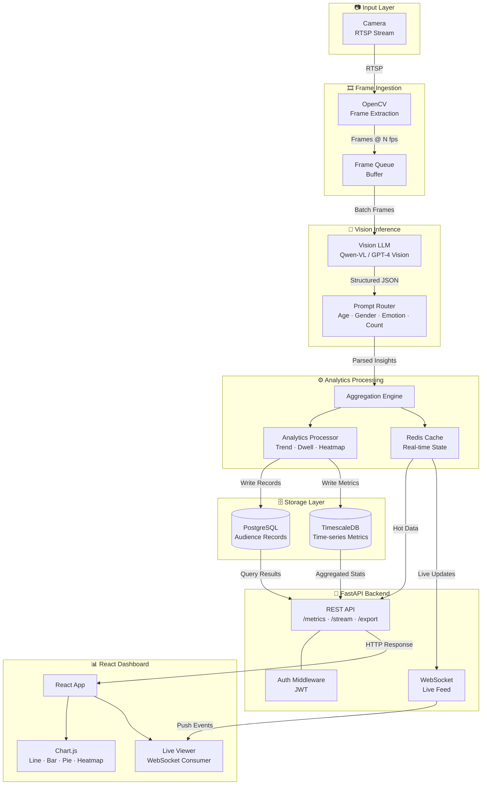

# Smart Audience Analysis — System Architecture

A real-time audience analytics system that uses Vision LLMs to analyze camera feeds and display insights on a live dashboard.

---

## System Architecture

---

## Tech Stack

| Layer | Technology |
|---|---|
| Video Input | Camera / RTSP Stream |
| Frame Extraction | OpenCV |
| Vision AI | Qwen-VL / GPT-4 Vision |
| Analytics | Custom Python Engine |
| Cache | Redis |
| Backend | FastAPI + WebSocket |
| Database | PostgreSQL + TimescaleDB |
| Frontend | React + Chart.js |

---

## Data Flow

1. **Camera** streams video over RTSP
2. **OpenCV** extracts frames at N fps into a buffer queue
3. **Vision LLM** analyzes each frame — detects age, gender, emotion, crowd count
4. **Analytics Processor** aggregates insights, computes trends and dwell time
5. **Redis** holds real-time state for instant WebSocket delivery
6. **PostgreSQL / TimescaleDB** stores historical records and time-series metrics
7. **FastAPI** serves REST endpoints and pushes live updates via WebSocket
8. **React Dashboard** visualizes everything with Chart.js charts and live feed
